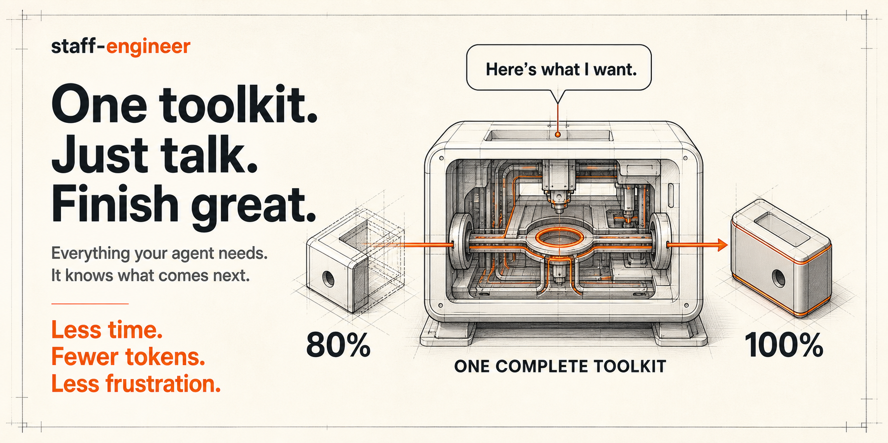

# Staff Engineer for AI Agents



**Turn your AI coding agent into a staff engineer you can trust with your product.**

A drop-in toolkit for Claude Code, Codex, Kimi, Pi, OpenCode, Cursor, and any other coding agent.
The agent interviews you before building, shows you a working result, has its code reviewed for
bugs and missed requirements, runs your project's own checks, and asks for your approval in plain
language before anything is saved. You never type a command; the agent drives everything. Any
language or framework, no dependencies, installed by the agent itself:

```text
"install https://github.com/kleber-maia/skill-staff-engineer into this project"
```

## The last 20 percent

A great model gets you to 80 percent of great software astonishingly fast. The last 20 percent is
judgment, and left alone, even the best agent behaves like a talented junior in their first week:

- **It starts typing before it understands**, and you find the wrong guess after the code exists.
- **It calls it done when the tests pass.** You never saw it work.
- **It misses things**: the edge case, the caller it broke, the requirement it forgot.
- **It leaves a mess**: debug output, suppressed warnings, three unrelated fixes in one commit.
- **It speaks engineer**, so you cannot judge whether the news is good.
- **It forgets.** Rules fade as the chat grows, and every new chat starts from zero.

None of this is a model problem. It is a process problem, and process needs durable checks, not
reminders. staff-engineer packages that judgment as skills the agent reads and a small CLI that
refuses to skip the steps that matter.

## What changes

| Before | After |
|---|---|
| The agent guesses at what you meant | It asks at most three questions, each with a recommended answer, and records what you agreed |
| "Done" means the tests pass | "Done" means **you** saw it working and said so; then it is reviewed, tested, cleaned up, and checked |
| Bugs, regressions, and missed requirements slip through | Every code change gets a review sized to its risk, from a quick self-check to several independent reviewers |
| A fixed bug comes back | A bug fix is saved only with a test that fails without the fix and passes with it |
| Debug lines, `TODO`s, `any`, oversized files slip in | A gate refuses them, in ten languages, before anything is saved |
| Unrelated changes ride along | One change, one commit; work that was already pending is kept out |
| Status reports are full of jargon | Every message to you is plain language |
| Praise for a screen is taken as a green light | Accepting a preview and approving a save are two separate, explicit steps |
| Every request pays the same process cost | A typo gets one check-in; a payments change gets a detailed review |
| Every chat starts from zero | It remembers your decisions, known weak spots, and what worked (below) |

## It remembers

The agent's memory lives in the project, not in a chat window, so it survives new chats, other
agents, and other machines.

- **Where you left off.** The current piece of work, its agreed outcome, and its step are kept in
  the project. Come back a week later and the agent continues exactly there.
- **Your decisions.** Every choice you settle ("export as CSV", "no scheduled emails") is saved with
  the change. Before asking you anything new, the agent sees the decisions that apply, so you are
  never asked twice. Committed, so teammates and other agents inherit them.
- **Known weak spots.** Problems a review found but left for later are saved with the files they
  affect. When later work touches those files, the agent sees them and can fix them while it is
  there, and it tells you when a weak spot remains near a change.
- **What works.** A private history on your machine tells the agent when changes keep needing
  extra rounds, a rule keeps getting waived, or a saved change was later undone, so it adjusts, and
  every tenth save you hear, in one line, how often things were right the first time.

## A session, from your seat

You: *"Customers should be able to export their order history."*

> **Q1. Format.** Spreadsheet or PDF? *Recommended: spreadsheet, customers like to filter it.*
> **Q2. Range.** Everything or chosen dates? *Recommended: chosen dates, "all time" by default.*

You say "go with your recommendations". The agent builds it and shows you where to try it, with
three things to check. You ask for one change, it revises, you say it looks good. An independent
reviewer then checks the change, the agent fixes what it found, runs your project's checks, and
asks:

> **What changed:** customers can export their order history as a spreadsheet.
> **What was checked:** the preview by hand, an independent code review, the automated tests, and a
> full build.
> **Is this finished and approved to save?** Reply "ship it" to save it, or "hold" to keep reviewing.

You reply "ship it". One commit lands, and "spreadsheet, chosen dates" is remembered for next time.

## Who it is for

- **Founders and operators without an engineering background** who run their product through an
  agent and want to approve outcomes, not read diffs.
- **Engineers using agents daily** who are tired of reviewing sloppy, unreviewed changes.
- **Teams mixing agents and people**: every agent reads the same contract from `AGENTS.md` and
  produces commits with the same shape.

## How it works

<p align="center">
  <picture>
    <source media="(prefers-color-scheme: dark)" srcset="docs/lifecycle-dark.svg">
    
  </picture>
</p>

- **Agree.** The agent opens one piece of work, sized into a lane (trivial, standard, large), and
  interviews you unless the request is obvious. It records the outcome and how you will check it.
- **Build.** It builds the smallest working version with focused tests, checks it itself where it
  can, and shows you. For a bug, it first writes a test that proves the bug. "Change this" loops
  back; "looks good" moves on.
- **Finish.** A code review sized to the risk hunts for bugs, regressions, edge cases, and missed
  requirements, and cleans the code up. Then the docs, the gate, and your project's full checks,
  once.
- **Save.** A plain-language handoff: what changed, what to look at, what was checked, what was
  left out. Only your "ship it" saves it, as one commit that records your words and the review.

Each step is a CLI command the agent runs, and `next` tells it which step comes next, so the order
lives in code rather than in the agent's memory. Small fixes get a single check-in: the preview
itself asks "ship it?". Your words carry their normal meaning: "change this" keeps working, "looks
good" finishes properly, "ship it" saves, and anything else is feedback, never permission.

<details>
<summary><strong>Under the hood</strong> (you do not need to read this)</summary>

- **Eleven skills** the agent reads on its own: the operating contract, the interview, SOLID, the
  risk-sized code review, the four cleanup lenses, UI finish, architecture boundaries, data safety,
  spec and plan, the handoff, and the installer.
- **A staged-diff gate** for debug output, suppressions, loose types, and unfinished markers in
  JavaScript/TypeScript, Python, Go, Rust, Ruby, Java/Kotlin, Swift, PHP, C#, and shell; UI finish
  rules; import boundaries; test-quality guards; docs and test coverage per batch. Every rule can
  be disabled or given a justified exception.
- **Reviews that cost what the risk warrants**: one packet (brief, diff, callers, tests, known
  issues) so reviewers never crawl the repository, delta-only re-reviews, and findings that need
  `file:line` evidence and a concrete failure.
- **Receipts instead of reruns**: the full check runs once per batch; the receipt proves it ran on
  exactly the code being saved. Free preview probes and bug reproductions run in the CLI, not the
  model.
- **Self-updating**: at most once a day, a newer toolkit is saved as its own change before work
  starts. Installing and updating the toolkit never go through the workflow themselves.
- **A Claude Code plugin** with slash commands, review subagents, and hooks that keep the next step
  in view, check approvals against what you actually typed, deny dangerous commands, and protect
  secrets.
- **Zero dependencies.** Node.js 20+ and git are all a project needs.

</details>

## Install

Point your agent at this repository and say **"install https://github.com/kleber-maia/skill-staff-engineer into this project"**. The
agent follows [AGENTS.md](AGENTS.md): dry run, install, then a short question loop to confirm how
your project is checked and started. Or do it yourself:

```bash
git clone https://github.com/kleber-maia/skill-staff-engineer ~/staff-engineer
cd your-project
node ~/staff-engineer/scripts/cli.mjs install --target . --dry-run   # review the plan
node ~/staff-engineer/scripts/cli.mjs install --target . --yes
node .staff-engineer/cli.mjs doctor                                   # answer its questions
```

Claude Code users can also add the plugin for slash commands, subagents, and hooks:

```bash
claude plugin marketplace add kleber-maia/skill-staff-engineer
claude plugin install staff-engineer@staff-engineer
# inside a project:  /staff-engineer:install
```

<details>
<summary><strong>What lands in your project</strong></summary>

```
.staff-engineer/        vendored CLI, rules, templates, config.json, exceptions.json,
                        and the committed memory: decisions.json, known-issues.json
.agents/skills/         the eleven skills, discovered by Claude Code, Codex, Cursor, and others
AGENTS.md               a managed block with the contract; your own text is untouched
CLAUDE.md               "@AGENTS.md" (created only if missing)
.gitignore              a managed block for toolkit backups
.claude/settings.json   hook entries, only with --with-claude-hooks (the plugin brings its own)
```

Detection fills `config.json` for Node, Python, Go, Rust, Ruby, Java/Kotlin, Swift, PHP,
Makefiles, and static sites; anything it cannot infer becomes a plain-language question the agent
asks you. Session state, receipts, review packets, screenshots, logs, operator messages, local
settings, and the insight history live under `.git/staff-engineer/`, never in history. Decisions
and known issues are the only toolkit data that is committed, because they belong to the project. Rerunning `install` upgrades only toolkit-owned files; `install --uninstall` removes them.

Every option, with its default and meaning, is described in
[schemas/config.schema.json](schemas/config.schema.json); per-machine preferences are listed by
`node .staff-engineer/cli.mjs settings`. Upgrades keep compatible defaults, and
[CHANGELOG.md](CHANGELOG.md) marks anything that changes behavior.

### Trust boundary

staff-engineer is a cooperative workflow, not a security sandbox. The vendored CLI can enforce the
rules of commands that pass through it: session transitions, protected staged batches, immutable
verification inputs, receipts, review records, approvals, and guarded commits. Claude Code hooks are optional,
harness-specific, and deliberately fail open if they break. Other agents follow the installed
skills and `AGENTS.md`; they are not technically prevented from invoking git directly. The default
`rules.requireSession: "warn"` also reports skipped session discipline without blocking standalone
lifecycle use; set it to `"block"` when the project wants the CLI gate to require a finalized
session and current context packet. Approvals are the operator's quoted words: in Claude Code they
are checked against messages the hook recorded, elsewhere they are trusted as reported, and every
commit says which (`Approval-Evidence`). They are an audit trail, not authentication. Likewise,
the CLI can require and record a code review, but it cannot prove the review was thorough.

For the curious: [docs/lifecycle.md](docs/lifecycle.md) walks through every step and what it
refuses, [docs/design.md](docs/design.md) explains why, and [docs/faq.md](docs/faq.md) answers the
usual questions. `npm test` runs the toolkit's own tests.

</details>

## License

MIT
