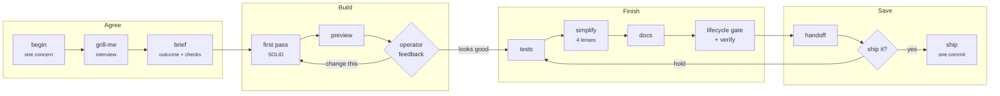

# staff-engineer

Make your AI coding agent work like a **staff engineer** for the person it helps, whether that
person is an engineer or has never opened a terminal. It interviews before it builds, follows
SOLID while it codes, shows a working preview before it writes tests, cleans up through a
four-lens review, runs your project's own checks through a gate, and asks for approval in plain
language before it saves.



Every arrow is enforced by a script, not just described in a prompt. Tests cannot run before
the operator accepts a preview. Nothing can be saved without a passing gate, a matching
verification receipt, and an explicit "ship it".

## Why it works

- **Skills carry the judgment.** `grill-me` settles the design in at most three rounds of three
  questions, each with a recommended answer. `solid` is the engineering standard: design,
  code, and test rules with reference notes on SOLID principles, architecture, clean code,
  code smells, complexity, design patterns, object design, and testing. `simplify` reviews the
  accepted change through four lenses (reuse, quality, efficiency, altitude) with `file:line`
  evidence and SAFE/CAREFUL/RISKY tiers. `ui-quality`, `architecture-boundaries`,
  `data-safety`, `spec-and-plan`, and `handoff` cover the rest of the job.
- **Scripts carry the discipline.** A zero-dependency Node CLI owns the session state machine,
  the staged-diff gate (debug output, suppressions, loose types, unfinished markers, broad
  helper files, oversized files, missing docs or tests, secrets, boundary violations, UI
  anti-patterns), the verification receipt, and the guarded commit.
- **It speaks the operator's language.** In non-technical mode, operator-facing messages carry
  no git, terminal, or code jargon. Acceptance of a preview is never treated as approval to
  save; approval is asked once, with a five-line handoff.
- **It is stack-agnostic.** The toolkit never ships a linter or test runner. It runs *your*
  commands from a small config, detected for Node, Python, Go, Rust, Ruby, Java/Kotlin,
  Swift, PHP, Makefiles, and static sites. Unknowns become plain-language questions.
- **It is harness-neutral.** A Claude Code plugin with slash commands, subagents, and hooks,
  *and* plain [Agent Skills](https://agentskills.io) plus an `AGENTS.md` block that Codex,
  Cursor, Gemini CLI, and other agents read.

## Install

Point your agent at this repository and say **"install staff-engineer into this project"**. It
follows [AGENTS.md](AGENTS.md). Or run it yourself:

```bash
git clone https://github.com/<owner>/skill-staff-engineer ~/staff-engineer
cd your-project
node ~/staff-engineer/scripts/cli.mjs install --target . --dry-run   # review the plan
node ~/staff-engineer/scripts/cli.mjs install --target . --yes
node .staff-engineer/cli.mjs doctor                                   # answer its questions
```

Claude Code users can add the plugin for slash commands, subagents, and hooks:

```bash
claude plugin marketplace add <owner>/skill-staff-engineer
claude plugin install staff-engineer@staff-engineer
# inside a project:  /staff-engineer:install
```

Requirements in the target project: Node.js 20+ and git. Nothing is installed from npm.

### What lands in your project

```
.staff-engineer/        vendored CLI, rules, templates, config.json, exceptions.json
.agents/skills/         staff-engineer, grill-me, solid, simplify, ui-quality,
                        architecture-boundaries, handoff, data-safety, spec-and-plan, install
AGENTS.md               a managed block; your own text outside the markers is untouched
CLAUDE.md               "@AGENTS.md" (created only if missing)
.gitignore              a managed block for toolkit backups
```

Session state, receipts, screenshots, and logs live under `.git/staff-engineer/`, never in
history. Rerunning `install` upgrades only toolkit-owned files; `install --uninstall` removes them.

## The commands

All commands are `node .staff-engineer/cli.mjs <command>` and accept `--json`.

| Command | Purpose | Refuses when |
|---|---|---|
| `begin "<concern>"` | Open one work session | another concern is open; pre-existing dirty files are fingerprinted and protected |
| `brief --outcome --accept …` | Record outcome, acceptance checks, non-goals, surfaces | no outcome or no acceptance check |
| `context <files…>` | Build the task-context packet: skills by phase, related docs and tests, imported dependencies | |
| `preview` | Present the result; read the checks back; capture screenshots when Playwright is present | no brief; web preview not reachable |
| `revise` | Return to implementation after feedback | |
| `finalize` | Record acceptance and unlock finishing | no preview presented; `STAFF_ENGINEER_PREVIEW_APPROVED=1` missing |
| `lifecycle` | Gate the staged batch | any blocking finding |
| `verify --mode fast\|full` | Run the configured checks; full writes the receipt and timing ledger | tests before feedback; unconfigured gates |
| `handoff` | Prefilled plain-language approval request | |
| `ship "<message>"` | One guarded commit with trailers | `STAFF_ENGINEER_CHANGE_APPROVED=1` missing; gate findings; stale receipt; too many areas |
| `status`, `abort`, `doctor`, `config`, `exception`, `update` | Housekeeping | |

Results follow one contract: `{ ok, code, data, operator, agent, errors }`, one plain sentence
for the operator and one next-step hint for the agent. Exit codes: 0 ok, 1 refused, 2 tooling
problem, 3 a check failed.

## Configuration

`.staff-engineer/config.json` is generated by detection and completed through `doctor`:

```json
{
  "operator": { "mode": "non-technical" },
  "gates": {
    "lint": { "cmd": "npm run lint" },
    "test": { "cmd": "npm test", "affected": "npx vitest run {files}" },
    "e2e": null
  },
  "preview": { "kind": "web", "cmd": "npm run dev", "url": "http://localhost:3000", "screenshots": "auto" },
  "paths": { "source": ["src/**"], "tests": ["**/*.test.*"], "protected": [".env", ".env.*"] },
  "rules": {
    "maxAddedLinesPerFile": 300,
    "requireTestPerSourceChange": true,
    "maxConcernCategories": 2,
    "ui": { "enabled": "auto" },
    "boundaries": [
      { "id": "no-cross-feature", "files": ["src/features/*/**"], "forbid": ["src/features/*/**"],
        "allow": ["src/features/*/index.*"], "sameArea": true,
        "message": "Import another feature only through its public entrypoint." }
    ]
  }
}
```

A gate that is an object runs; `null` means "not applicable, confirmed"; a missing gate is a
question `doctor` asks. `preview.kind` is `web`, `command`, or `manual`, so libraries and CLIs
are first-class. Language rules live in `rules/languages.json` and UI rules in `rules/ui.json`;
disable any with `rules.disable`, or record a permanent, justified exception with
`exception add`.

## Claude Code extras

Slash commands for every lifecycle step, subagents for the four simplify lenses plus a read-only
explorer and a verifier, and hooks that inject session state at start, deny dangerous commands
(force pushes, hard resets, recursive deletes, piping downloads into a shell), protect secrets,
block tests before feedback, and block raw commits while a concern is open. Hooks fail open and
stay silent in projects without an install.

## Repository layout

```
skills/        canonical Agent Skills (copied into projects)
commands/      Claude Code slash commands
agents/        Claude Code subagents
hooks/         plugin hook registration
scripts/       zero-dependency CLI (cli.mjs, commands/, lib/, hooks/) and its tests
rules/         language, UI, and structural rule tables
templates/     managed AGENTS.md block, definition of done, handoff, spec, plan
schemas/       JSON schema for config.json
fixtures/      sample projects and diffs used by the tests
docs/          lifecycle, design rationale, FAQ
```

Development: `npm test` runs the unit tests and the repository lint.

## License

MIT
