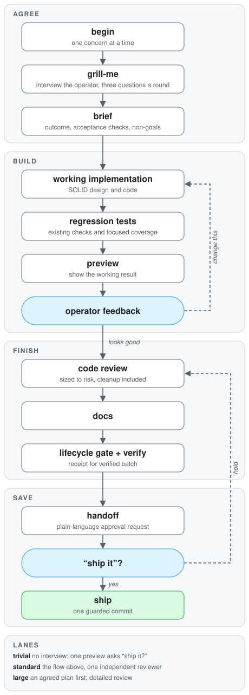

# staff-engineer

**Turn your AI coding agent into a staff engineer you can trust with your product.**

A drop-in toolkit for Claude Code, Codex, Cursor, Gemini CLI, and any other coding agent. It makes the
agent interview you before building, show you a working result before writing tests, follow SOLID
while it codes, clean up after itself, run your project's own checks through a gate, and ask for
your approval in plain language before anything is saved. Works with any language or framework.
No dependencies. Installed by the agent itself in one instruction.

```text
"install staff-engineer into this project"
```

## The problem

Coding agents are fast and eager. Left alone, they behave like a talented junior on their first
week:

- **They start typing before they understand.** Ambiguity gets resolved by guessing, and you
  discover the wrong guess after the code is written.
- **They call it done when the tests pass.** You never saw it work. Tests written before you looked
  at the result cement the wrong behavior and make every change request expensive.
- **They leave a mess.** Debug output, `TODO`s, suppressed warnings, weakened types, a new
  `utils.ts` nobody owns, a 600-line file, and three unrelated fixes swept into one commit.
- **They speak engineer.** "I refactored the service layer and rebased onto main." If you are not
  an engineer, you cannot judge whether that is good news.
- **They forget the rules.** Instructions in a prompt fade as the conversation grows. The tenth
  task is done sloppier than the first.
- **Every project starts from zero.** The careful setup you built for one repository does not
  travel to the next one, or to a different agent.

None of this is a model problem. It is a process problem, and process needs enforcement, not
reminders.

## What changes

| Before | After |
|---|---|
| The agent guesses at what you meant | The agent asks at most three questions per round, each with a recommended answer, and records the agreed outcome and how you will check it |
| "Done" means the tests pass | "Done" means **you** saw it working, said so, and then it got tested, cleaned up, documented, and checked |
| Tests are written first and defended later | Tests are written **after** you accept the preview, so they protect what you actually wanted |
| Debug lines, `TODO`s, `any`, `eslint-disable`, oversized files slip through | A staged-diff gate refuses them, in ten languages, before anything is saved |
| Unrelated changes ride along in one commit | One concern, one session, one commit. Files that were already dirty are fingerprinted and kept out |
| Cross-feature imports and UI shortcuts accumulate | Architecture boundaries and UI finish rules are checked on every batch |
| Status reports are full of git and terminal jargon | Every operator-facing message is plain language: what changed, what to look at, what was checked, what was left out |
| Praise for a screen is treated as a green light | Acceptance of a preview and approval to save are two separate, explicit steps |
| Rules live in a prompt and decay | Rules live in scripts and hooks that refuse out-of-order steps, on every task, forever |
| Setup is per project and per agent | One install: skills for every agent, a Claude Code plugin, and a vendored CLI that upgrades in place |

## Who it is for

- **Founders and operators without an engineering background** who run their product through an
  agent. You get a collaborator that explains itself, shows its work, and never saves without
  asking.
- **Engineers using agents daily** who are tired of reviewing sloppy diffs. You get a colleague
  who follows SOLID, keeps batches small, and cleans up before handing over.
- **Teams mixing agents and people.** Every agent in every harness reads the same contract from
  `AGENTS.md`, runs the same gates, and produces commits with the same shape and trailers.

## A session, from your seat

You: *"Customers should be able to export their order history."*

The agent opens one concern and asks, in a single message:

> **Q1. Format.** Spreadsheet or PDF? *Recommended: spreadsheet (CSV), because customers usually
> want to filter it.*
> **Q2. Range.** Everything, or a chosen date range? *Recommended: a date range with "all time" as
> the default.*
> **Q3. Where.** A button on the Orders page, or in Account settings? *Recommended: Orders page,
> next to the filters.*

You answer, or say "go with your recommendations". The agent records the brief, builds the smallest
working version, and comes back:

> The export is ready to try at your preview address. Please check: 1) Open Orders and find the
> Export button next to the filters. 2) Export all time and confirm the file opens with one row per
> order. 3) Pick last month and confirm only those orders are included. Tell me what to change, or
> say it looks good.

You ask for a change; the agent revises and shows it again. You say it looks good. Only now it
writes tests, runs a four-lens cleanup review, updates the docs, passes the gate, runs your
project's full checks once, and asks:

> **What changed:** Customers can export their order history as a spreadsheet, for all time or a
> chosen date range.
> **What to look at:** the Orders page, the Export button next to the filters.
> **What was checked:** the preview by hand on desktop and mobile, the automated tests, code style,
> type safety, and a full build.
> **Left out on purpose:** PDF export.
> **Is this finished and approved to save?** Reply "ship it" to save it, or "hold" to keep reviewing.

You reply "ship it". One commit lands, carrying the agreed outcome in its trailer. Nothing else.

## How it works

<p align="center">
  <picture>
    <source media="(prefers-color-scheme: dark)" srcset="docs/lifecycle-dark.svg">
    
  </picture>
</p>

Every arrow is enforced by a script, not just described in a prompt:

- **Agree.** `begin` opens exactly one work session and fingerprints anything already pending so it
  cannot be swept in. The `grill-me` skill runs the interview. `brief` records the outcome and the
  acceptance checks you will perform. `context` gathers the skills, docs, tests, and dependencies
  relevant to the planned files.
- **Build.** The `solid` skill governs the code: design, code, and test rules, with reference notes
  on SOLID principles, architecture, clean code, code smells, complexity, design patterns, object
  design, and testing. `preview` presents the result and reads your checks back. Until you accept,
  test runs and test edits are refused.
- **Finish.** Tests, then the `simplify` skill (four lenses: reuse, quality, efficiency, altitude,
  every finding with `file:line` evidence and a SAFE/CAREFUL/RISKY tier), then docs. The
  `lifecycle` gate inspects the staged diff. `verify` runs your project's own format, lint,
  typecheck, test, build, and end-to-end commands and writes a receipt for that exact code.
- **Save.** `handoff` prints the approval request. `ship` refuses without your "ship it", without a
  passing gate, without a matching receipt, or with too many unrelated areas in one batch.

## What you get

**Ten skills** (plain Markdown, readable by any agent): `staff-engineer` (the contract),
`grill-me`, `solid`, `simplify`, `ui-quality`, `architecture-boundaries`, `data-safety`,
`spec-and-plan`, `handoff`, `install`.

**A gate that knows your language.** Debug output, suppressions, loose types, and unfinished
markers for JavaScript/TypeScript, Python, Go, Rust, Ruby, Java/Kotlin, Swift, PHP, C#, and shell.
UI rules for browser dialogs, raw colors, arbitrary sizes, and marketing cliches. Import boundary
rules you configure. Every rule can be disabled or given a permanent, justified exception.

**A verification wrapper** that runs *your* commands, stops at the first failure with a focused
`file:line` report, keeps a timing ledger, warns when a check runs slower than usual, and never
retries "to be safe".

**A Claude Code plugin** with a slash command for every step, subagents for the four simplify
lenses plus a read-only explorer and a verifier, and hooks that inject session state at start, deny
dangerous commands (force pushes, hard resets, recursive deletes, piping downloads into a shell),
protect secrets, block tests before feedback, and block raw commits while a concern is open.

**Zero dependencies.** Node.js 20+ and git are all a project needs. Nothing is installed from npm.

## Install

Point your agent at this repository and say **"install staff-engineer into this project"**. The
agent follows [AGENTS.md](AGENTS.md): dry run, install, then a short question loop to confirm how
your project is checked and started. Or do it yourself:

```bash
git clone https://github.com/kleber-maia/skill-staff-engineer ~/staff-engineer
cd your-project
node ~/staff-engineer/scripts/cli.mjs install --target . --dry-run   # review the plan
node ~/staff-engineer/scripts/cli.mjs install --target . --yes
node .staff-engineer/cli.mjs doctor                                   # answer its questions
```

Claude Code users can also add the plugin for slash commands, subagents, and hooks:

```bash
claude plugin marketplace add kleber-maia/skill-staff-engineer
claude plugin install staff-engineer@staff-engineer
# inside a project:  /staff-engineer:install
```

### What lands in your project

```
.staff-engineer/        vendored CLI, rules, templates, config.json, exceptions.json
.agents/skills/         the ten skills, discovered by Claude Code, Codex, Cursor, and others
AGENTS.md               a managed block with the contract; your own text is untouched
CLAUDE.md               "@AGENTS.md" (created only if missing)
.gitignore              a managed block for toolkit backups
```

Detection fills `config.json` for Node, Python, Go, Rust, Ruby, Java/Kotlin, Swift, PHP,
Makefiles, and static sites; anything it cannot infer becomes a plain-language question. Session
state, receipts, screenshots, and logs live under `.git/staff-engineer/`, never in history.
Rerunning `install` upgrades only toolkit-owned files; `install --uninstall` removes them.

## Reference

All commands are `node .staff-engineer/cli.mjs <command>` and accept `--json`, returning
`{ ok, code, data, operator, agent, errors }`: one plain sentence for the operator, one next-step
hint for the agent.

| Command | Purpose | Refuses when |
|---|---|---|
| `begin "<concern>"` | Open one work session | another concern is open |
| `brief --outcome --accept …` | Record outcome, acceptance checks, non-goals, surfaces | no outcome or no acceptance check |
| `context <files…>` | Skills by phase, related docs and tests, imported dependencies | |
| `preview` | Present the result; read the checks back; screenshots when Playwright is present | no brief; web preview not reachable |
| `revise` | Return to implementation after feedback | |
| `finalize` | Record acceptance and unlock finishing | no preview presented; `STAFF_ENGINEER_PREVIEW_APPROVED=1` missing |
| `lifecycle` | Gate the staged batch | any blocking finding |
| `verify --mode fast\|full` | Run the configured checks; full writes the receipt | tests before feedback; unconfigured gates |
| `handoff` | Prefilled plain-language approval request | |
| `ship "<message>"` | One guarded commit with trailers | `STAFF_ENGINEER_CHANGE_APPROVED=1` missing; gate findings; stale receipt; too many areas |
| `status`, `abort`, `doctor`, `config`, `exception`, `update` | Housekeeping | |

Configuration lives in `.staff-engineer/config.json`: gates (`install`, `format`, `lint`,
`typecheck`, `test`, `e2e`, `build`), preview (`web`, `command`, or `manual`), path globs, rule
settings, boundary rules, and `operator.mode` (`non-technical` or `technical`, same gates either
way). See [docs/lifecycle.md](docs/lifecycle.md), [docs/design.md](docs/design.md), and
[docs/faq.md](docs/faq.md).

Development: `npm test` runs the unit tests and the repository lint.

## License

MIT
